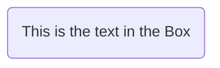

# Mermaid Testing

## Diagram Syntax
### A node (rhombus)

```mermaid
flowchart LR
    id1(This is the text in the Box)
```

### A hexagon node

```mermaid
flowchard LR
    id1({This is the text in the box})
```